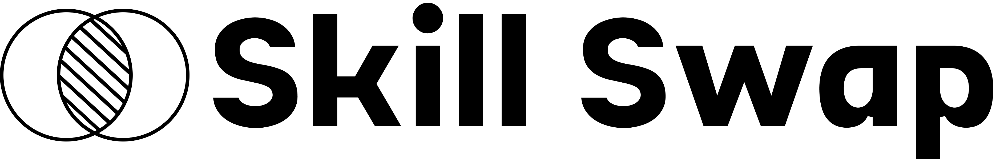

<div align="center">
  <!-- LOGO PLACEHOLDER -->
  
  <br>

  <p>
    <b>Exchange. Learn. Grow.</b><br>
    The modern platform for discovering people, exchanging skills, and building your future!
  </p>

  <p>
    
    
    
    
  </p>

  <p>
    
    
    
    
    
  </p>
</div>

---

## ✨ Features & Widgets

| 🧩 Widget                 | 🚦 Description                                             |
|-------------------------- |-----------------------------------------------------------|
| 👤 **Profile Cards**       | Showcase your skills, expertise, and learning interests   |
| 🔄 **Swap Request Widget** | Request, accept, or reject skill swaps instantly          |
| ⭐ **Feedback Carousel**    | See and share swap feedback, building trust               |
| 🔔 **Live Notifications**  | Real-time alerts for swaps, feedback, and announcements   |
| 🛠️ **Admin Dashboard**     | Platform management, user moderation, and analytics       |
| 💬 **Platform Messages**   | Admins can broadcast updates to all users                 |
| 🌙 **Dark/Light Mode**     | Switch between visually stunning themes                   |
| 🧭 **Responsive Navigation**| Mobile-first sidebar and top navigation                  |

---

## ⚡ Tech Stack

- **Frontend:** React, TypeScript, Vite, TailwindCSS
- **Backend:** FastAPI (Python), REST API
- **Database:** SQLite/PostgreSQL (configurable)
- **Authentication:** Clerk.dev (or similar)
- **State & Storage:** LocalStorage, API integration

---

## 🚦 Quick Start

<details>
<summary><b>Frontend</b></summary>

```bash
cd frontend
npm install
npm run dev
```
</details>

<details>
<summary><b>Backend</b></summary>

```bash
cd backend
python -m venv venv
source venv/bin/activate
pip install -r requirements.txt
uvicorn main:app --reload
```
</details>

---

## 🧭 Project Structure

```
.
├── frontend/         # React + TypeScript client
├── backend/          # FastAPI backend
├── src/lib/          # Shared libraries & utilities
├── README.md
```

---

## 📝 Contributing

> All contributions are welcome!  
> Please read our guidelines before submitting a pull request.

1. Fork the repo
2. Create your branch (`git checkout -b feature/your-feature`)
3. Commit your changes (`git commit -am 'Add feature'`)
4. Push to the branch (`git push origin feature/your-feature`)
5. Open a Pull Request


---

<div align="center" style="margin-top: 32px; font-size: 1.2em;">
  <b>Skill Swap</b> — <i>Exchange. Learn. Grow.</i><br>
</div>
